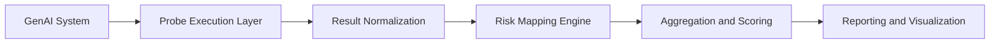

# High-Level Architecture

AI Risk Inspector is designed as a modular platform that separates risk execution, risk interpretation, and reporting concerns.

## Architectural Principles

- Separation of concerns
- Extensible risk probes and categories
- Repeatable and auditable assessments
- Security-first output handling
